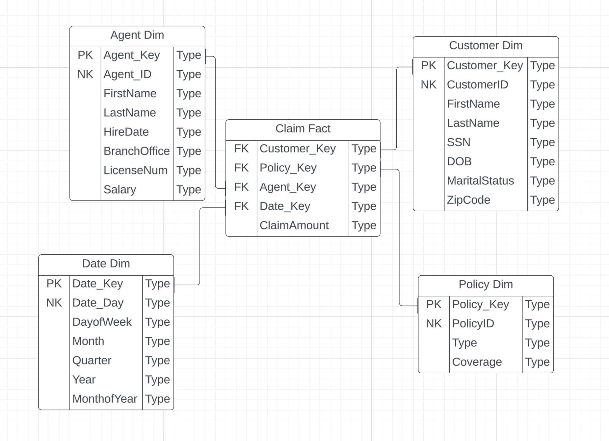

# dbt Exercise Instructions #
- Let's jump into a ELT demo using Airbyte and dbt. Remember the insurance exercise where we took an insurance transaction and created a dimensional model based on the given business process and transaction? We decided on the below dimensional model:



- Now, we are going to use a semi-normalized transactional database given to us by Sarah's insurance company. Let's work through an ELT process for Sarah's insurance company using Airbyte and dbt. 
### Extract and Load (Airbyte) ###
- Ensure that you are connected to the University VPN
- Open the Docker application
- Start Airbyte by opening a terminal and running the following (you may be able to just click the local host link below instead of running the following):
``` cd airbyte ```
``` ./run-ab-platform.sh ```
- Open up a browser and go to http://localhost:8000. It can take a while for the Airbyte service to start, so don't be surprised if it takes ~10 minutes.
    - Username: airbyte
    - Password: password
- Click `Set up a new source`
- When defining a source, select `Microsoft SQL Server (MSSQL)`
    - Host: `stairway.usu.edu`
    - Port: `1433`
    - Database: `5360_insurance2`
    - Username: `5360_student`
    - Password: `datawarehousing` (you'll need to click the dropdown for optional fields)
- Select `Scan Changes with User Defined Cursor`
- Click `Set up source`
    - Airbyte will run a connection test on the source to make sure it is set up properly
- Create a schema in your firstnamelastname database named `Insurance` and ensure you have a data warehouse named `lastname_wh`

- Once Airbyte has run the connection test successfully, you will pick a destination, select `Pick a destination`.
- Find and click on `Snowflake`
    - Host: `https://rbb67081.snowflakecomputing.com` 
    - Role: `TRAINING_ROLE` 
    - Warehouse: `lastname_WH` 
    - Database: `firstnamelastname` 
    - Schema: `INSURANCE` (create this schema in your firstnamelastname database)
    - Username: 
    - Authorization Method: `Username and Password`
    - Password: 
    - Click `Set up destination`
- Once the connection test passes, it will pull up the new connection window
    - Change schedule type to `Manual`
    - Under `Activate the streams you want to sync`, click the button next to each table.
    - Click Set up connection
    - Click `Sync now`
    - Once it's done, go to Snowflake and verify that you see data in the landing database

### Transform (dbt) ###
- Open VSCode
- File > Open > Select your project (lastname_DW)
- On the top bar of the application, select Terminal > New Terminal
    - This will open a terminal in the directory of your project within VSCode
- Right click on the models directory and create a new folder inside of it. (Be careful not to create it inside of the example directory.)
- Call this new folder `insurance`
- Right click on insurance and create a new file. Name this file `_src_insurance.yml`
    - In this file we will add all of the sources for the insurance tables
- Below is the code that we will use in this file:
```
version: 2

sources:
  - name: insurance_landing
    database: firstnamelastname
    schema: insurance
    tables:
      - name: agentpolicy
      - name: agents
      - name: claims
      - name: customers
      - name: policies
```

- If you need to make any changes to your Snowflake information in your dbt project you can change it by going to your dbt profile.yml file. You may need to change the schema. 
    - On a mac, this is located under your user directory. You have to click Shift + command + . in order to see hidden folders. The .dbt folder will appear and inside is profiles.yml
    - On Windows, it's just in the user directory under the .dbt folder and the profiles.yml is inside.
    - Once you have found the profiles.yml file you can open in a text editor, change the needed parameters and save the file. 


#### dim agent ####
- Create a new file inside of the insurance directory called `dim_agent.sql`
- Here is the code for dim_agent:
```
{{ config(
    materialized = 'table',
    schema = 'dw_insurance'
    )
}}

SELECT
{{ dbt_utils.generate_surrogate_key(['agentid', 'phone']) }} as agent_key,
agentid,
firstname,
lastname,
email,
phone
FROM {{ source('insurance_landing', 'agents') }}
```
- The dbt_utils macro comes from the below package. Create a packages.yml file in the same folder as your dbt_project.yml file. Paste this in the packages.yml file:
```
packages:
    - package: dbt-labs/dbt_utils
    version: 1.1.1
```  
- Save the file, after you have done that, you can go to your terminal and type `dbt run -m dim_agent` to build the model.
    - Go to Snowflake to see the newly created table!

#### dim customer ####
- Create a new file inside of the insurance directory called `dim_customer.sql`
- Here is the code for dim_customer:
```
{{ config(
    materialized = 'table',
    schema = 'dw_insurance'
    )
}}


select
{{ dbt_utils.generate_surrogate_key(['customerid', 'firstname']) }} as customer_key,
customerid,
firstname,
lastname,
dob,
address,
city,
state,
zipcode
FROM {{ source('insurance_landing', 'customers') }}
```

- Save the file, after you have done that, you can go to your terminal and type `dbt run -m dim_customer` to build the model.
    - Go to Snowflake to see the newly created table!

#### dim_policy ####
- Create a new file inside of the insurance directory called `dim_policy.sql`
- Here is the code for dim_policy:
```
{{ config(
    materialized = 'table',
    schema = 'dw_insurance'
    )
}}


select
{{ dbt_utils.generate_surrogate_key(['policyid', 'policytype']) }} as policy_key,
policyid,
policytype
FROM {{ source('insurance_landing', 'policies') }}
```

- Save the file, after you have done that, you can go to your terminal and type `dbt run -m dim_policy` to build the model.
    - Go to Snowflake to see the newly created table!


#### dim_date ####
- Create a new file inside of the insurance directory called `dim_date.sql`
- Here is the code for dim_date (This will create a date dimensions for us and then we we use a cte to select out of that only the fields we want):


```
{{ config(
    materialized = 'table',
    schema = 'dw_insurance'
    )
}}

with cte_date as (
{{ dbt_date.get_date_dimension("1990-01-01", "2050-12-31") }}
)

SELECT
date_day as date_key,
date_day,
day_of_week,
month_of_year,
month_name,
quarter_of_year,
year_number
from cte_date
```

- The dbt_date macro comes from the below package. Create a packages.yml file in the same folder as your dbt_project.yml file. Paste this in the packages.yml file:

  - package: calogica/dbt_date
    version: [">=0.9.0", "<0.10.0"]

- Then run `dbt deps`

- Save the file, after you have done that, you can go to your terminal and type `dbt run -m dim_date` to build the model.
    - Go to Snowflake to see the newly created table!


#### fact_claim ####
- Create a new file inside of the insurance directory called `fact_claim.sql`
- Here is the code for fact_claim:
```
{{ config(
    materialized = 'table',
    schema = 'dw_insurance'
) }}

SELECT
    p.policy_key,
    cu.customer_key,
    a.agent_key,
    d.date_key,
    c.ClaimAmount
FROM {{ source('insurance_landing', 'claims') }} c
INNER JOIN {{ source('insurance_landing', 'policies') }} pd ON c.PolicyID = pd.PolicyID
INNER JOIN {{ ref('dim_policy') }} p ON pd.PolicyID = p.policyid 
INNER JOIN {{ ref('dim_customer') }} cu ON pd.CustomerID = cu.customerid 
INNER JOIN {{ ref('dim_agent') }} a ON pd.AgentID = a.agentid 
INNER JOIN {{ ref('dim_date') }} d ON d.date_day = c.ClaimDate

```

- Save the file, after you have done that, you can go to your terminal and type `dbt run -m fact_claim` to build the model.
    - Go to Snowflake to see the newly created table!

- If for some reason you need to run all files then you can run: `dbt run -m insurance`.

#### schema yaml file ####
- Create a new file inside the insurance directory called `_schema_insurance.yml`
- This file contains metadata about the models you build. It is not required, but highly encouraged by dbt to document your models. It's a lot of tedious work so doesn't seem super necessary for this exercise, but building the file is still a good habit to get into.
- Structure the file just like the following code:
```
version: 2

models:
  - name: dim_agent
    description: "Insurance Agent Dimension"
  - name: dim_customer
    description: "Insurance Customer Dimension"
  - name: dim_date
    description: "Insurance Date Dimension"
  - name: dim_policy
    description: "Insurance Policy Dimension"
  - name: fact_claim
    description: "Insurance Claim Fact"
```

## Create a semantic layer model (time permitting)
- Create a model that can query from the data warehouse we just built and reference upstream models.
- Create a new file called `sem_claims.sql` inside of the insurance directory.
- In order to view lineage, the dbt power user extension must be installed. Click on the Lineage tab in vscode (down by the terminal on the bottom), if you are inside the sem_claims.sql model, you should be able to see lineage for that model. View the lineage for the other files in the model as well. 
