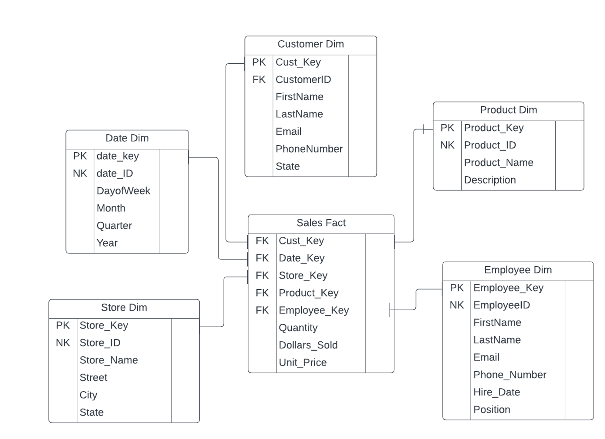

# Core #5 Instructions #
## Objective ##
- In this assignment, students will practice their fundamental dimensional modeling skills and ELT by creating and populating a star schema for a given business process and relational database.
- For context, Core #3, #4, and #5 all build upon each other. 
     - Core #3: You created a draft dimensional model in LucidChart based on a given business process and transaction. 
     - Core #4: You will populate your draft dimensional model (and act upon any feedback received) from a dataset provided to you via a file. 
     - Core #5: You will use FiveTran to pull in all of Oliver’s relational database data from an Amazon RDS Postgres instance and then use dbt to transform and populate our final dimensional model. HINT! The dbt exercise we completed in class will be EXTREMELY helpful as you complete the assignment. 

## Background & Data ##
- Oliver’s sweets and drinks serves a variety of products, including coffee, a variety of sodas, popcorn, and other tasty treats. Oliver’s currently has a transactional database system to track all store purchases across their 10 stores. They are now interested in developing a data warehouse using dimensional modeling (star schema) to improve their data analysis capabilities.  You will be modeling the point-of-sale business process at Oliver’s. You have already created a sample dimensional model and populated it for Oliver’s by uploading files of data. Now, after creating the dimensional model and showing it to Oliver’s data team, they have settled on the below dimensional model design. 



## Assignment ##
- Now, we are going to use a semi-normalized transactional database given to us by Oliver's. You are very familiar with this dataset! You are going to create an ELT process for Oliver's using Airbyte & dbt. Download this markdown file and open it in VSCode, then populate the empty "code" boxes below with the code you use to complete this assignment. Then, submit this markdown file in Canvas. All teammates should complete the assignment in their own database, but you can troubleshoot together! Also, submit proof the data loaded in your Snowflake database (this can be a screenshot/query output).
### Extract and Load (FiveTran) ###
- Sign into fivetran
- Click on 'Connections'
    - Click 'Add Connection'
- Search for and select 'Amazon RDS for PostgreSQL'
- Select the destination you previously set up for Snowflake
- Set the Destination schema prefix to `oliver`
- Set the Host to `database-1.c3ckkcekkkxp.us-east-1.rds.amazonaws.com`
- Set the user to `fivetran_usr`
- Set the password to `dw_fivetran`
- Set the database to `oliver`
- Set Update Method to 'Detect Changes via Fivetran Teleport Sync'
- Click 'Save & Test'
- Click 'Continue' even if it says 'XMIN extensions not enabled'
- When you get to the Select Data to Sync page, make sure that the following 6 tables are selected and click 'Save & Continue':
    - customer
    - employee
    - orderline
    - orders
    - product
    - store
- Choose to allow all changes
- Click 'Sync Now' in the top right corner
- Wait for the sync to finish, login to Snowflake, check to see if you have a new schema in your database called `oliver_dw_source`
    - Confirm that the tables created and that they have data
- Go back to fivetran, click on connectors on the left hand side, click your connector that you just set up
    - Make sure the toggle on the top right is set to paused. If it's set to enabled, then click it and change it to paused.

### Transform (dbt) ###
- Login to dbt Cloud
- Click Develop > Cloud IDE
- Before making any changes, we need to open an new git branch.
    - Go to the repository for your project in GitHub
    - Create a new branch by clicking branches > new branch
        - Name the branch `core5`
- Go back to the dbt Cloud IDE
    - Click Change branch > select your new branch and click `Checkout`

- Right click on the models directory and create a new folder inside of it. (Be careful not to create it inside of the example directory.)
- Call this new folder `oliver`
- Right click on oliver and create a new file. Name this file `_src_oliver.yml`
    - In this file we will add all of the sources for Oliver's tables
- Populate the code that we will use in this file below: 
```

```


#### dim customer ####
- Create a new file inside of the oliver directory called `oliver_dim_customer.sql`
- Populate the code that we will use in this file below: 
```

```

- Save the file, after you have done that, you can go to your terminal and type `dbt run -m oliver_dim_customer` to build the model.
    - Go to Snowflake to see the newly created table!

#### dim date ####
- Create a new file inside of the oliver directory called `oliver_dim_date.sql`
- Populate the code that we will use in this file below: 
```

```

- Save the file, after you have done that, you can go to your terminal and type `dbt run -m oliver_dim_date` to build the model. Go to Snowflake to see the newly created table!

#### dim_employee ####
- Create a new file inside of the oliver directory called `oliver_dim_employee.sql`
- Populate the code that we will use in this file below: 
```

```

- Save the file and build the model. Go to Snowflake to see the newly created table! 

#### dim product ####
- Create a new file inside of the oliver directory called `oliver_dim_product.sql`
- Populate the code that we will use in this file below: 


```

```

- Save the file and build the model. Go to Snowflake to see the newly created table!


#### dim store ####
- Create a new file inside of the oliver directory called `oliver_dim_store.sql`
- Populate the code that we will use in this file below: 
```


```

- Save the file and build the model. Go to Snowflake to see the newly created table!


#### fact sales ####
- Create a new file inside of the oliver directory called `fact_sales.sql`
- Populate the code that we will use in this file below: 
```


```

- Save the file and build the model. Go to Snowflake to see the newly created table!


#### schema yaml file ####
- Create a new file inside the oliver directory called `_schema_oliver.yml`
- This file contains metadata about the models you build. Hint: check out the exercise to help you create this file. 
- Populate the code that we will use in this file below: 
```

```

## Create a semantic layer model 
- Create a model that can query from the data warehouse we just built and reference upstream models.
- Create a new file called `sales.sql` inside of the oliver directory.
- Basically, your code will create a new table that will be a semantic layer that is easy for consumption. The table should include key information that an analyst could easily pull from to run quick analysis. 
- This model should use 'ref' instead of source in the from statements. This will allow dbt to build lineage dag of the model dependencies:
- Populate the code that we will use in this file below: 
```

```

## View Lineage and Generate Docs ##
- View Lineage for your semantic layer model by clicking on the model in the file explorer and clicking lineage on the bottom window.
    - If you did not create the semantic layer model, then select your fact model.
- Submit a screenshot of the DAG.
- Run `dbt docs generate` in the command line
- Click the docs icon to the right of the `Change branch` link.
- Select the claims model from the project explorer on the left.

## Create a Pull Request on GitHub for the changes you have made ##
- Click Save on any files that you have made changes in.
- Click `Commit and Sync`
- Type a commit message explaining the changes you've made. Click `Commit Changes`.
- Click `Create a pull request on GitHub`
    - You will be redirected to GitHub
- Review your changes and click `Create pull request`
- Type a description about the changes you are proposing to the project.
- Click `Create Pull Request`
- merge your branch into the main branch by clicking `Merge pull request`.
